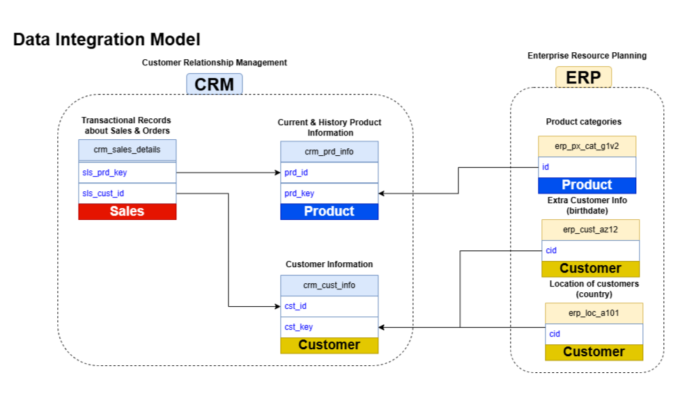
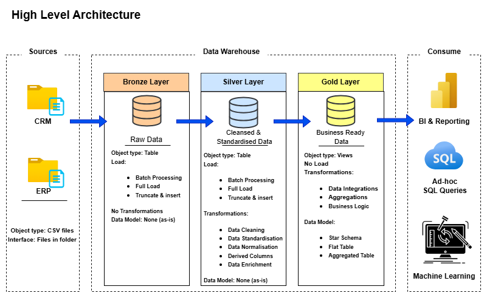
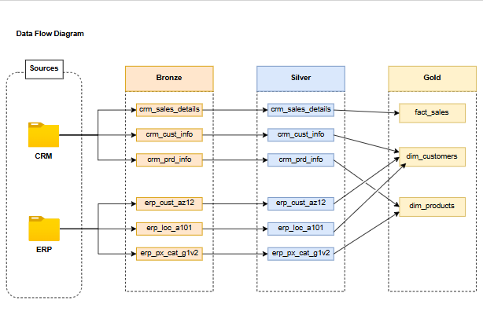
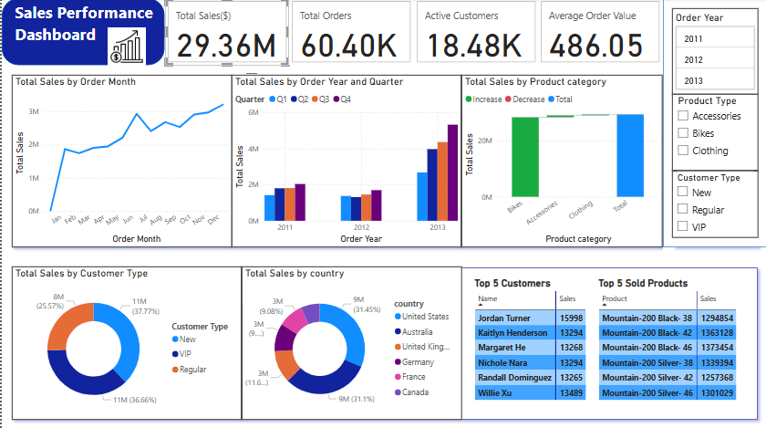

# Data Warehouse and Data Analysis Project

This project demonstrates a comprehensive data warehousing and analytics solution,from building a data warehouse to generating actionable insights.

---
---
## Project Overview

This project involves:

- **Data Architecture:** Designing a Modern Data Warehouse Using Medallion Architecture Bronze, Silver, and Gold layers.
- **ETL Pipelines:** Extracting, transforming, and loading data from source systems into the warehouse.
- **Data Modeling:** Developing fact and dimension tables optimized for analytical queries.
- **Analytics & Reporting:** Creating SQL-based reports and **PowerBI dashboards** for actionable insights.

The dataset used for the projects originally constitutes of six different tables, belonging to two different source systems:

```
dataset/
|
├── source_crm/                           # Data-source for Customer Relationship Management(CRM)
│   ├── cust_info.csv                     # Customer information
│   ├── prd_info.csv                      # Information about current and history products
│   ├── sales_details.csv                 # Transactional records about sales and orders
│
├── source_erp/                           # Data-source for Enterprise Resource Planning(ERP)
│   ├── CUST_AZ12.csv                     # Additional Customer info
│   ├── LOC_A101.csv                      # Location info of Customers
│   ├── PX_CAT_G1V2.csv                   # Product Categories info
|
```

<p align="left">
  
</p>

---
---
## Project Requirements

### 1. Building the Data Warehouse

#### 1.1 Objective 

Develope a modern data warehouse using SQL Server to consolidate sales data,enabling analytics and informed decision-making.

#### 1.2 Data Warehouse Architecture



<br>

- **Bronze Layer:** Stores raw data as-is from the source systems. Data is ingested from CSV Files into SQL Server Database.
- **Silver Layer:** This layer includes data cleansing, standardization, and normalization processes to prepare data for analysis.
- **Gold Layer:** Houses business-ready data modeled into a star schema required for reporting and analytics.

---
#### 1.3 Specifications

- **Data Sources:** Import Data from two source systems:**ERP**(*Enterprise Resource Planning*) & **CRM**(*Customer Relationship Management*),that are provided as CSV files
- **Data Quality:** Cleanse and resolve data quality issues prior to analysis
- **Integration:** Combine both sources into single, user-friendly data model designed for analytical queries.



---
### 2. Analytics & Reporting

#### 2.1 Objective

Develope comprehensive collection of SQL scripts for data exploration, analytics, and reporting. These scripts cover various analyses such as database exploration, measures and metrics, time-based trends, cumulative analytics, segmentation, and more to deliver detailed insights into:
- Customer Behaviour
- Product Performance
- Sales Trends

#### 2.2 Data Analysis

We have already created views in the gold layer : **dim_customers,dim_products,dim_fact_sales**. These three will be used to perform **Exploratory Data Analysis**,**Advanced Data Analysis** and creating **Report Views** for **dashboarding**.

Any column can be categories as a **Measure** or **Dimesnion**. 
- Is it numeric ? YES. Does it make sense to aggregate it ? YES
- Hence you have found a measure,evrything else is a Dimension.

**Data Analysis Report** <br>

The data contains orders over 37 months between dates : **2010-12-29 **to **2014-01-28**.
There are **18,484 customers** fo our business. <br>
Male and female customers are almost 9300 and 9100 respectively, somewhat equal contribution. <br>
The customers belong to six different countries,while there are few customers whose country of origin is unknown. <br>

| Country | Count | Country | Count |
|---------|-------|---------|-------|
| USA | 7482 | Germany | 1780 |
| Australia | 3591 | Canada | 1571 |
| UK | 1913 | n/a | 337 |
| France | 1810 |  |  |

The youngest and oldest customer of our business are aged 39 and 109 years respectively. <br>
The Top-5 customers who have generated the highest revenue:

| Customer Name | Total Expenditure |
|---------------|-------------------|
| Katlyn Henderson | 13294 |
| Nichole Nara | 13294 |
| Margaret He | 13268 |
| Randall Dominguez | 13265 |
| Maurice Shan | 13242 |

| Number of Orders | Number of Customers |
|-----------------|-----------------|
| 1 | 11619 |
| 2 | 1254 |
| 3 | 1166 |
| 4 | 150 |
| 5 | 51 |
|>5 |44 |

There are ~ 11.6K customers who have placed an order only once. The number of two and three time customers is similar but drops rapidly for orders greater than three.

| customer_segments | total_customers |
|-------------------|-----------------|
| VIP               | 1655            |
| Regular           | 2198            |
| New               | 14631           |

On grouping customers into three segments based on their spending behavior:
   - VIP: Customers with at least 12 months of history and spending more than €5,000.
   - Regular: Customers with at least 12 months of history but spending €5,000 or less.
   - New: Customers with a lifespan less than 12 months.
we can see that :
- the vast majority (14,631) are new customers - indicating strong customer acquisition.
- A good regular cusomer base suggesting strong retention.
- A good VIP base (1,655) suggesting successful upselling and customer value growth.

There are mainly four categories for the business: **Accessories,Bikes,Clothing** and **Components**. <br> There are 295 different types of products that are being sold across category. <br>
Category wise distribution is as follows:

| Category | Total Nr Products | Average Cost |Total Sales (Volume)| Total Revenue($) |
|----------|-------------------| -------------|--------------------|---------------|
| Components | 127 | 264 | - | - |
| Bikes | 97 | 343 | 15205 | ~ 28.3 M |
| Clothing | 35 | 24 |9101| ~340K |
| Accessories | 29 | 13 |36092| ~ 700K |


- Components have the maximum number of products but during this period,not a single product from this category has been sold.
- Bikes are the costliest items on average, and they have produced the majority of the revenue (close to **96%** ).
- Clothing and Accessories have a small spectrum of cheaper products to offer.
- Accessories are the most sold out item,neaarly double than bikes. But since they are on avg cheaper,they don't contribute anything major to the revenue.

| Cost Range | Total Products |
|------------|----------------|
| Above 1000 | 39 |
| 500-1000 | 45 |
| 100-500 | 101 |
| Below 100 | 110 |

- Most products (110) are in the budget category (below $100)
- A good middle segment (101) in the $100-500 range
- Fewer premium products (39 above $1000)
- The distribution suggests a pyramid structure with more affordable options than high-end products

| Best Performing Products | Profit Margin(%) | Worst Performing Products | Profit Margin(%) |
|-------------------------|---------------|---------------------------|---------------|
| Road Tire Tube | 300 | Short-Sleeve Classic Jersey- M | 28.57 |
| Racing Socks- L | 200 | AWC Logo Cap | 28.57 |
| Road Bottle Cage | 200 | Short-Sleeve Classic Jersey- XL | 28.57 |
| Racing Socks- M | 200 | Short-Sleeve Classic Jersey- S | 28.57 |
| LL Mountain Tire | 178.42 | Short-Sleeve Classic Jersey- L | 28.57 |

The abover table contains the best and worst performing products respectively based on Profit Margin of the products across all the sales.

So on analysing the sales over the years, we can see that 2013 has been the best year. <br>
Also,keep in mind that first  and last orders came on 2010-12-29 and 2014-01-28 respectively,so no point in comparing them.

| Order Year | Total Sales | Total Customers | Total Quantity | Running Total Sales |
|------------|-------------|-----------------|----------------|---------------------|
| 2010 | 43419 | 14 | 14 | 43419 |
| 2011 | 7075088 | 2216 | 2216 | 7118507|
| 2012 | 5842231 | 3255 | 3397 | 12960738 |
| 2013 | 16344878 | 17427 | 52807 | 29305616 |
| 2014 | 45642 | 834 | 1970 | 29351258 |

- The total customers has increased over the years and so has the sales by volume. <br>
- Interesentigly, our business sold more items to more customers in 2012 compared to 2011 and still generated less revenue. <br>
- A possible reason could be selling of less costly goods. <br>

SQL queries for answering all the above questions are present in the form of two scripts: [EDA](./scripts/analytics/eda.sql) and [Advanced Analytics](./scripts/analytics/advanced_analytics.sql) <br>
There are two other SQL scripts: [Customer Report](./scripts/analytics/customer_report.sql) and [Product Report](./scripts/analytics/product_report.sql) that let you create two views named '**report_customers**' and '**report_products**' that summarises a lot of the related data and can be used for dashboarding.

#### 2.3 Sales Performance Dashboard

The views created earlier were used to create an interactive [dashboard](Sales%20Performance%20Dashboard.pbix) using *PowerBI*. <br>
It gives a summary of sales for presenting at the executive levels. If desired,you can create a more detailed dashboard for products and customers separately.



```

